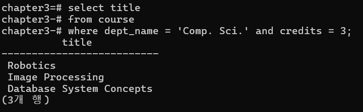

**a. Find the titles of courses in the ‘Comp. Sci.’ department that have 3
credits.**

```sql
select title
from course
where dept_name = 'Comp. Sci.' and credits = 3;
```



**b. Find the IDs of all students who were taught by an instructor named
‘Srinivasan’; make sure there are no duplicates in the result.**

```sql
select distinct takes.ID
from takes, instructor, teaches
where takes.course_id = teaches.course_id and
takes.sec_id = teaches.sec_id and
takes.semester = teaches.semester and
takes.year = teaches.year and
teaches.id = instructor.id and
instructor.name = 'Srinivasan';
```


**c. Find the ID and name of instructors who have not given grades to
students (i.e., where the grade is null in the takes relation).**

```sql
select t3.id, t3.name
from takes t1, teaches t2, instructor t3
where (t1.course_id, t1.sec_id, t1.semester, t1.year) = (t2.course_id, t2.sec_id,
t2.semester, t2.year) and
t2.id = t3.id and
t1.grade is null;
```


**d. Find the name and department name of instructors whose department
name starts with “C”, listed alphabetically by department name.**

```sql
select name, dept_name
from instructor
where dept_name like 'C%' order by dept_name;
```


**e. Find the ID and salary of the instructor(s) with the highest salary while
satisfying the following conditions.**

1. **Use Set Operation (“EXCEPT”)**

```sql
(select id, salary from instructor) except
(select t1.id, t1.salary from instructor t1, instructor t2 where t1.salary < t2.salary);
```

1. **Use Aggregate Function**

```sql
select id, salary 
from instructor
where salary = (select max(salary) from instructor);
```


---

**Make a relation 𝑔𝑟𝑎𝑑𝑒_𝑝𝑜𝑖𝑛𝑡𝑠(𝑔𝑟𝑎𝑑𝑒, 𝑝𝑜𝑖𝑛𝑡𝑠), which provides a conversion from letter grades in the 𝑡𝑎𝑘𝑒𝑠 relation to numeric scores.**


**The tuples of the 𝑔𝑟𝑎𝑑𝑒_𝑝𝑜𝑖𝑛𝑡𝑠 relation: (A+, 4.3), (A, 4.0), (A-, 3.7), (B+, 3.3), (B,
3.0), (B-, 2.7), (C+, 2.3), (C, 2.0), (C-, 1.7), (D+, 1.3), (D, 1.0), (D-, 0.7), (F, 0.0)**


**The grade-points a student earns for a course offering (section) are calculated by multiplying the number of credits for the course by the numeric grade points received for that course.**

**For simplicity, you can assume that no 𝑡𝑎𝑘𝑒𝑠 tuple has a null value for the grade attribute.**

**a. Find the total grade-points earned by the student with ID 12345, across all
courses taken by the student.**

```sql
select sum(credits*points) 
from course, takes, grade_points
where course.course_id = takes.course_id and
takes.grade = grade_points.grade and
id = '12345';
```


**b. Find the grade-point average (GPA) for the above student, that is, the total
grade-points divided by the total credits for the associated courses.
• 평균 평점 = (과목별 점수 * 과목의 학점 수) / 전체 학점 수**

```sql
select sum(credits*points)/sum(credits) as GPA 
from course, takes, grade_points
where course.course_id = takes.course_id and
takes.grade = grade_points.grade and
id = '12345';
```


**c. Find the ID and the grade-points average of every student.**

```sql
select id, sum(credits*points)/sum(credits) as GPA 
from course, takes, grade_points
where course.course_id = takes.course_id and takes.grade = grade_points.grade
group by id;
```


**d. Find the ID and the grade-points average of students whose GPA is greater
than 3.0.**

