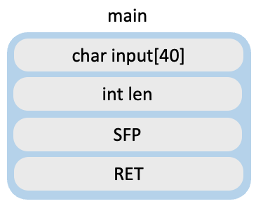
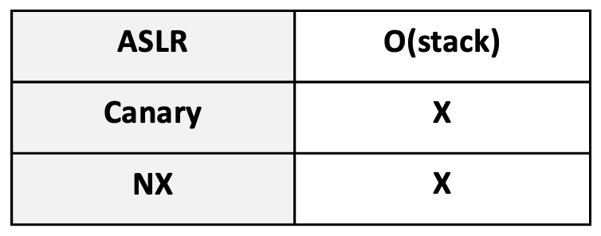

# Assignment 1. super_safe

<aside>
😜 Defense against stack buffer overflow attacks is soooo eeeeasy. 
I wonder why so many mitigations have been researched all this time.

</aside>

- code
    
    ```c
    #include <stdio.h>
    
    /*
    ssize_t read (int fd, void *buf, size_t nbytes)
    
    size_t : "same as unsigned int"
    read : read from a file descriptor.
           If the file descriptor is 0, it means input is received through standard input.
    */
    
    int main(void){
      int len;
      char input[40]="";
    
      setvbuf(stdin, 0, _IONBF, 0);   // Function for setting up remote. You don't need to care about it when solving the problem.
      setvbuf(stdout, 0, _IONBF, 0);  // Function for setting up remote. You don't need to care about it when solving the problem.
    
      printf("I introduced input length checks to prevent buffer overflow.\nIt seems very safe, isn't it?\n\ninput length : \n");
      scanf("%d", &len);
      if(len > 40){
        printf("len error! program exit.\n");
        return 0;
      }
      printf("stack : %p\n", input);    // print stack address
      read(0, input, len);
      printf("%s", input);
      return 0;
    }
    ```
    
- binary
    - refer to github repository please
- Difficulty
    - ⭐⭐ (ez)
- Stack information



- Mitigation information

