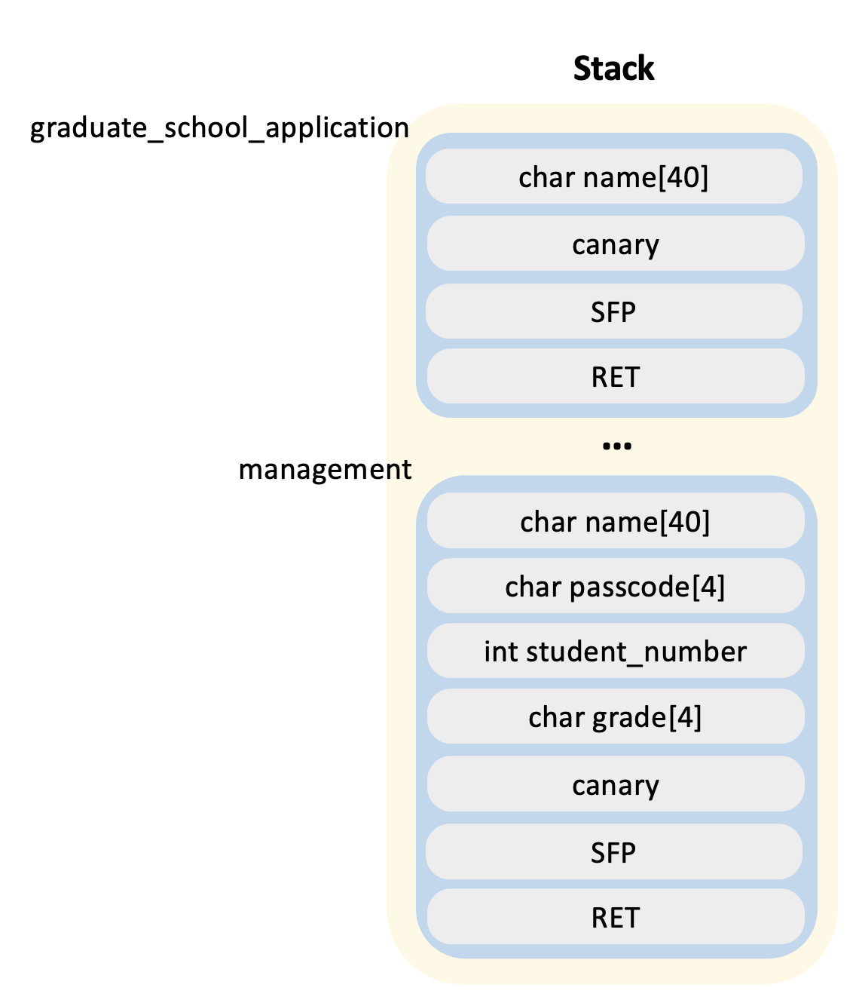
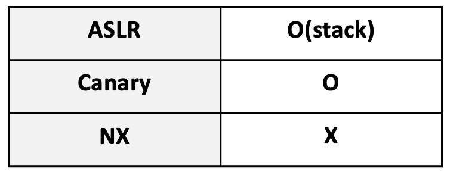

# Hidden : HackTheWoo2

<aside>
🎓 I've successfully accessed the professor woo’s grade management system! 
My dream is to enter graduate school. 
Let's manipulate my grades to an A+ and apply for graduate school. 
And... just in case, it might be a good idea to hack the professor woo’s computer too.

</aside>

- code
    
    ```c
    #include <stdio.h>
    #include <stdlib.h>
    #include <time.h>
    #include <string.h>
    
    /*
    I obtained access to the professor's grade management program.
    Can I change my grade to an 'A' and also get access to the shell?
    */
    
    typedef struct Student_{
      char name[40];
      char passcode[4];
      int student_number;
      char grade[4];
    }Student;
    
    void menu(Student *student);
    void input(Student *student);
    void print_info(Student *student);
    void graduate_school_application(Student *student);
    void init_passcode(Student *student);
    
    void menu(Student *student){
      int num;
      printf("1: Input\n2: Print info\n3: graduate_school_application\n");
      scanf("%d", &num);
      if(num==1) input(student);
      else if(num==2) print_info(student);
      else if(num==3) graduate_school_application(student);
      else printf("num error\n");
      return;
    }
    
    void input(Student *student){
      char passcode[4];
      printf("enter below informations.\n\n");
      printf("[student number]\n");
      scanf("%d", &student->student_number);
      printf("[name]\n");
      read(0, student->name, 40);
      printf("[grade]\n");
      read(0, student->grade, 5);
      if(strncmp(student->grade, "A+", 2) == 0){
        printf("To award an A+ grade, please enter the passcode:\n");
        read(0, passcode, 4);
        if(strncmp(student->passcode, passcode, 4) != 0){
          printf("Error. You will get F grade.\n");
          strcpy(student->grade, "F");
        }
      }
    }
    
    void print_info(Student *student){
      printf("name : %s\n", student->name);
      printf("student number : %d\n", student->student_number);
    }
    
    void graduate_school_application(Student *student){
      char name[40];
      if(strncmp(student->grade, "A+", 2)){
        printf("You need to have an A+ grade to apply to the graduate school\n");
        return;
      }
      printf("Congratulation! you can apply graduate school ^^\n");  
      printf("Please enter your name\n");
      read(0, name, 100);
      printf("Well done. I'll text you soon.\n");
      return;
    }
    
    void init_passcode(Student *student){
      int i;
      for(i=0; i<4; i++){
        student->passcode[i] = rand()%256;
      }
    }
    
    int management(){
      int i;
      Student student = {"", "", 0, ""};
      
      srand((unsigned int)time(NULL));
    
      printf("[Professor Woo's grade management program]\n\n");
    
      init_passcode(&student);
      for(i=0; i<10; i++){
        menu(&student);
      }
      return 0;
    }
    
    int main(){
      management();
      return 0;
    }
    ```
    
- binary
    - Please refer to github repository
- Difficulty
    - ⭐⭐⭐⭐⭐ `(buldak bokkeummyeon)`
- Stack information



- Mitigation information



- Hint
    - The canary value is the same across all functions
    - (graduate_school_application function’s name variable address) - (management functoin’s sfp value)  = 0x94